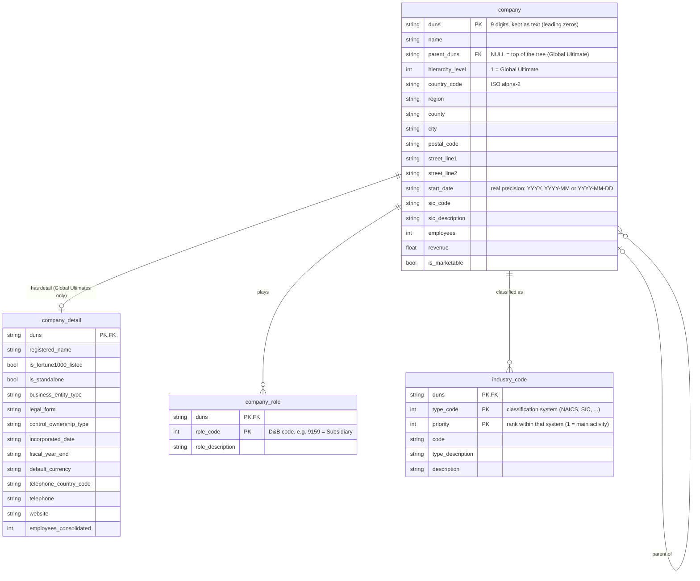

# Entity-Relationship Diagram

## Sources

| Table | Source | Rows |
|---|---|---|
| `company` | `family_tree.json` (every member) | 876 |
| `company_detail` | `data_blocks.json` | 3 |
| `company_role` | `family_tree.json` → `corporateLinkage.familytreeRolesPlayed` | 1 633 |
| `industry_code` | `data_blocks.json` → `industryCodes` | 36 |

## Design choices

- **The hierarchy is a self-reference.** `parent_duns` points to another row of `company`, so one column
  handles a tree of any depth. The `children` lists in the source are **not stored**: they are the same
  relationship seen from the other side. The pipeline uses them only as a consistency check.
- **Model ≠ output file.** The model is normalised: each fact lives in one place. The default Parquet output
  is one wide, pre-joined table (`companies_enriched`), which is more convenient for analysis. Running with
  `--write-model` also writes these tables, one file each, to `output/model/`.
- **Accepted repetition.** `sic_description` and `role_description` repeat for every company with the same
  code. Lookup tables would remove that, but they would add tables for very little gain at this size.
- **`industry_code` is keyed by rank, not by code.** D&B ranks each company's activities (priority 1, 2, 3...)
  per classification system, and the same code can fill several ranks: Microsoft lists "Software Publishers"
  at priorities 1, 2 and 3. The pipeline's data checks caught this on the first run.
- **Not modelled (possible extensions):** trade names (`tradeStyleNames`, up to 5 per company), stock
  exchanges, registration numbers, and the rest of the `data_blocks` lists. They all follow the same 1:N
  pattern as `industry_code`.
