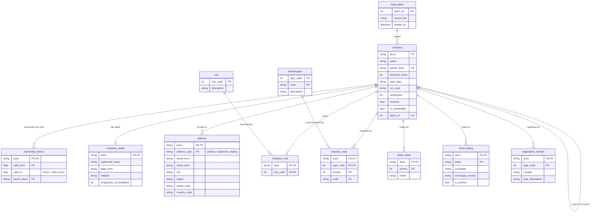

# Future ERD (not implemented)

This is where the current model ([erd.md](erd.md)) could go when the data grows, or when more questions need
answering. Nothing here is built. Each change is listed with the question it answers.

## What changes, and why

| Change | Question it answers | Today |
|---|---|---|
| **`ownership_history`** (valid_from / valid_to) | "Who owned this company in 2022?" Companies are bought and sold, and today each run only keeps the latest parent. | `company.parent_duns` holds only the current parent |
| **`address`**, one row per address type | "Where is it registered, and where does it receive mail?" `data_blocks` has primary, registered and mailing addresses. | only the primary address, as columns on `company` |
| **Lookup tables** `role` and `classification` | Removes the accepted repetition: each description is stored once. It also gives one place to fix a description. | descriptions repeated on every row |
| **`trade_name`**, **`stock_listing`**, **`registration_number`** | "What brands does it trade under? Where is it listed? What are its official IDs?" | not modelled |
| **`load_batch`** | "Which file and which run did this row come from?" Needed to debug and audit once there are many loads. | not tracked |

## Why this isn't built now

It isn't needed for 876 companies and 3 families, and every extra table is more code to validate and explain.
The current model already follows the same patterns (self-reference, 1:0..1, 1:N), so each change above is an
extension of it, not a redesign.
